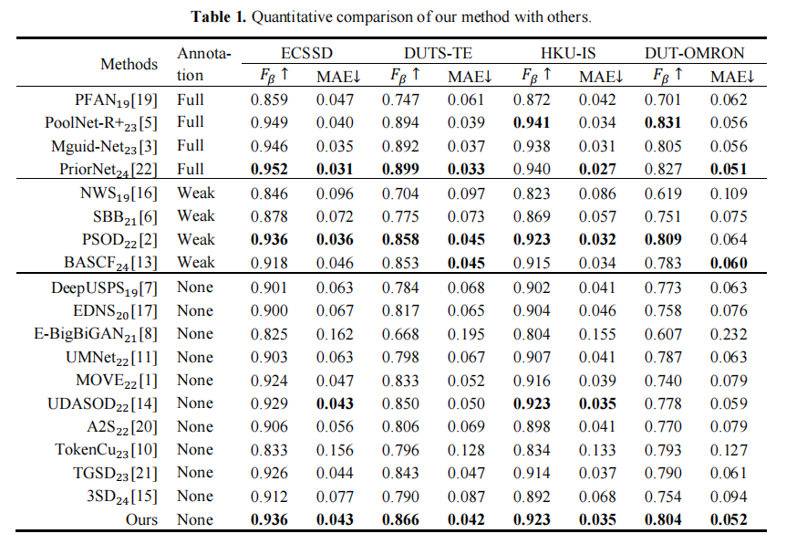

# Annotation-free Salient Object Detection via Spatial-enhanced Contrastive Learning and SAM

Code repository for our paper "Annotation-free Salient Object Detection via Spatial-enhanced Contrastive Learning and SAM" in  ICIC 2025 .

## Dataset

### Dataset for training:

#### DUTS-TR

You can download the dataset from [here](https://saliencydetection.net/duts/) without using the mask.

### Dataset for testing:

#### ECSSD

#### DUTS-TE

#### HKU-IS

#### DUT-OMRON

## Stage1: Activation Map Generation via SCCAM

please refer to the directory of './SCCAM_stage1'

```
cd SCCAM_stage1
```

The training command is

```
sh mytrain.sh
```

The model file directory after training is' ./experiments/models'

## Stage2: Pseudo-label Generation

please refer to the directory of './SAM_stage2'

```
cd SAM_stage2
```

* To get the SAM Segmentation via Point Prompt :

```
python3 point_cut.py
```

* To get the SAM Segmentation via Box Prompt :

```
python3 box_cut.py
```

* Perform initial reliable pseudo-label selection:

```
python3 similarity_test.py
```

## Stage3: Model training

please refer to the directory of './A2S_stage3'

```
cd A2S_stage3
```

In './data.py', modify the 'gt_root'

In'/test.py',modify the 'weight_path','save_folder' and 'list_file'

Perform initial SOD model training:

```
python3 train_stage2.py cornet --gpus=1
```

Execute the test command as follows：

```
python3 test.py cornet --weight=/data/A2S-stage3/weight/cornet/resnet/base/cornet_base_20_SAMall-iou-80.pth --gpus=1 --save
```

In'./data.py',odify 'self.images, self.gts = get_image_list(name, config, 'test')' to 'self.images, self.gts = get_image_list(name, config, 'test_predict')'

Then predicte the training set images ：

```
python3 test.py cornet --weight=/data/A2S-stage3/weight/cornet/resnet/base/cornet_base_20_SAMall-iou-80.pth --gpus=1 --save
```

Screening of A2S predicted labels and sam reliable labels :

```
cd SAM_stage2
```

```
python3 similarity_reliable_stage3.py
```

Screening of A2S predicted labels and sam unreliable labels :

```
python3 similarity_delete_stage3.py
```

A2S retraining

In'./A2S_stage3/data.py', modify the  'gt_root' , 'gt_root' is the combination of 'gt_root1' and 'gt_root2'

Training and testing instructions are the same as above

## Evaluate

please refer to the directory of './Saliency-Evaluation/Saliency-Evaluation-Toolbox-master'

```
cd Saliency-Evaluation/Saliency-Evaluation-Toolbox-master
```

Change the folder path and run python3 test.py directly

## Result



## Reference
